Awesome understanding! Please think deeper and think harder to deeply and thoroughly explore how best to re-imagine a gorgeous, attractive, stunning, refreshing, trendy static HTML mock-up for the following project design concept/description. Then meticulously plan to create an implementation plan to create the "re-imagined" static HTML as mock-up for the desired/envisioned dynamic landing page. Review and validate your implementation plan before proceeding cautiously to executte it to generate the static HTML mock-up of the landing page.

# 🌿 Atelier Arôme
### Illuminated Manuscript E-Commerce Platform

#### Artisanal Aromatherapy • Headless Commerce • Renaissance Aesthetics

---

## ✨ Elevator Pitch

A production-grade headless e-commerce platform for artisanal aromatherapy, featuring a distinctive **"Illuminated Manuscript"** Renaissance-inspired aesthetic that rejects generic e-commerce templates in favor of bespoke design excellence.

**Built for:** Singapore market with GST (9%), PayNow integration, and SingPost shipping.

**Architecture:** Laravel 12 API + Next.js 15 Frontend (Headless Commerce)

---

## 🎯 Why Atelier Arôme?

### Design Philosophy: Anti-Generic 🎨

We deliberately reject:
- ❌ Inter/Roboto/system font "safety"
- ❌ Purple-gradient-on-white clichés
- ❌ Predictable card grids and hero sections
- ❌ Homogenized "AI slop" aesthetics

Instead, we emphasize:
- ✅ **Renaissance-inspired "Illuminated Manuscript"** visual language
- ✅ Custom Tailwind theme with Cormorant Garamond, Crimson Pro, Great Vibes fonts
- ✅ Alchemical and botanical themes aligned with aromatherapy heritage
- ✅ **WCAG AAA accessibility** with reduced motion support

### Technical Excellence 🏗

- **Enterprise Architecture:** Headless commerce with Laravel 12 API + Next.js 15 frontend
- **Security-First:** OWASP Top 10 mitigation, PCI compliance via Stripe
- **Performance:** 95+ Lighthouse target, <2s page load, edge deployment
- **Scalability:** Support for 10,000+ products, 1,000+ concurrent users
- **Data Integrity:** UUID primary keys, soft deletes, snapshot pattern for orders

### Singapore Localization 🇸🇬
- **GST (9%)** calculated on `subtotal + shipping`
- **PayNow** payment method via Stripe
- **SingPost** shipping API integration
- **SGD currency** with `$` prefix (not `S$`)

---

## 🏗 Architecture Overview

```mermaid
graph TB
    subgraph "Client Layer"
        U[User Browser]
    end
    
    subgraph "Frontend Layer - Next.js 15"
        FE[Next.js 15 App]
        UI["Components<br/>- Shadcn-UI<br/>- Tailwind Theme<br/>- Framer Motion"]
        STATE["State Management<br/>- Zustand (UI)<br/>- TanStack Query (Server)"]
        FE --> UI
        FE --> STATE
    end
    
    subgraph "API Layer - Laravel 12"
        API[Laravel 12 REST API]
        AUTH[Laravel Sanctum<br/>- Token Auth]
        RES["API Resources<br/>- JSON Transformers"]
        API --> AUTH
        API --> RES
    end
    
    subgraph "Business Logic"
        SERVICE["Services<br/>- GST Service<br/>- Coupon Service<br/>- Order Service"]
        QUEUE["Queue Jobs<br/>- Laravel Horizon<br/>- Email Processing"]
        SERVICE --> QUEUE
    end
    
    subgraph "Data Layer"
        PG[(PostgreSQL 16<br/>- 24 Tables<br/>- UUID PKs)]
        REDIS[(Redis 7.x<br/>- Cache/Session/Queue)]
        MEILI[(Meilisearch<br/>- Full-text Search)]
    end
    
    subgraph "External Services"
        STRIPE[Stripe<br/>- Payments + PayNow]
        SINGPOST[SingPost<br/>- Shipping Tracking]
        CLOUDINARY[Cloudinary<br/>- CDN for Images]
        MAIL[Mailhog<br/>- Email Testing]
    end
    
    U --> FE
    FE -->|JSON API| API
    API --> SERVICE
    SERVICE -->|SQL| PG
    SERVICE -->|Cache/Queue| REDIS
    SERVICE -->|Search Index| MEILI
    API -->|Payment Processing| STRIPE
    API -->|Shipping Updates| SINGPOST
    FE -->|Static Assets| CLOUDINARY
    API --> MAIL
    
    style FE fill:#C9A769
    style API fill:#2A2D26
    style PG fill:#7CB9A0
    style REDIS fill:#B87D7D
    style STRIPE fill:#635BFF
```

### High-Level System Architecture

```mermaid
graph LR
    subgraph "Frontend - Vercel Edge"
        NEXT[Next.js 15<br/>- React 19 + TS 5]
    end
    
    subgraph "Backend - Laravel Forge/Vapor"
        LARAVEL[Laravel 12<br/>- PHP 8.3 + Sanctum]
        FILAMENT[Filament 3.x<br/>- Admin Panel]
        HORIZON[Laravel Horizon<br/>- Queue Dashboard]
    end
    
    subgraph "Infrastructure"
        NEON[(Neon<br/>- PostgreSQL 16)]
        UPSTASH[(Upstash<br/>- Redis 7.x)]
        CLOUDFLARE[Cloudflare<br/>- CDN]
        VERCEL[Vercel<br/>- Edge Network]
    end
    
    subgraph "External Services"
        STRIPE[Stripe<br/>- Payments]
        MEILISEARCH[Meilisearch<br/>- Search]
    end
    
    NEXT -->|JSON API| LARAVEL
    LARAVEL -->|SQL| NEON
    LARAVEL -->|Cache/Queue| UPSTASH
    NEXT -->|Static Assets| VERCEL
    NEXT -->|Images| CLOUDFLARE
    LARAVEL -->|Search Index| MEILISEARCH
    LARAVEL -->|Payment Processing| STRIPE
    
    style NEXT fill:#FAF8F5
    style LARAVEL fill:#2A2D26
    style NEON fill:#7CB9A0
    style UPSTASH fill:#B87D7D
    style STRIPE fill:#635BFF
```

# Sample Thinking Process
The user is asking me to design a stunning, refreshing, trendy static HTML mock-up for "Atelier Arôme" - an artisanal aromatherapy e-commerce platform with an "Illuminated Manuscript" Renaissance-inspired aesthetic.

Let me deeply analyze this request:

PHASE 1: DEEP ANALYSIS
Understanding the Brand & Vision
Atelier Arôme = "Workshop of Aroma/Fragrance" (French)

Artisanal aromatherapy products
Singapore market (GST 9%, PayNow, SingPost, SGD)
Illuminated Manuscript aesthetic = Medieval/Renaissance decorated manuscripts with gold leaf, intricate borders, botanical illustrations, calligraphic text
Design Direction Analysis
The "Illuminated Manuscript" concept is rich and specific. Let me break it down:

Historical Reference Points:

Medieval manuscripts (500-1500 CE)
Gold leaf illumination
Intricate botanical borders and marginalia
Decorated capitals (drop caps)
Hand-lettered calligraphy
Vellum/parchment textures
Rich but limited color palettes (ultramarine, vermillion, gold, forest greens)
Typography Stack (from brief):

Cormorant Garamond - Elegant serif (body, headings)
Crimson Pro - Classic serif (secondary)
Great Vibes - Script/calligraphic (accents, decorative)
Color Palette Exploration (Renaissance-inspired):

Deep forest greens (botanical)
Warm golds and ambers (illumination)
Cream/parchment backgrounds (manuscript pages)
Rich burgundy/crimson accents
Deep navy/ultramarine (rare, precious pigment feel)
Soft sage greens (herbs, aromatherapy)
I need to incorporate ornate borders, botanical illustrations, and decorative drop caps throughout the design. Gold foil effects using CSS gradients and SVG will enhance the illuminated quality, while subtle parchment textures ground the aesthetic. Hand-drawn decorative elements and alchemical symbols reinforce the aromatherapy heritage and craftsmanship story. The target audience—premium product seekers who value artisanal quality and wellness—will respond to this sophisticated, heritage-driven visual language that feels both timeless and intentional.

The decorative richness must enhance the hierarchy rather than compete with product information. I'm balancing aesthetic complexity with clean product presentation, ensuring the Renaissance-inspired elements guide attention rather than distract. This means restraint in placement and purposeful use of ornamental details.

For implementation, I'm working within static HTML that transitions to Next.js 15, using Tailwind CSS 4.0 while maintaining WCAG AAA compliance and sub-2-second load times. Reduced motion support is essential. The design deliberately moves away from generic e-commerce conventions—no standard card grids or predictable hero sections—instead favoring asymmetric layouts with intentional whitespace and decorative framing that feels distinctly curated.

The concept frames the entire experience as pages from an illuminated manuscript, where products become treasures displayed with narrative context. Asymmetric editorial layouts with generous margins create a folio-like structure, botanical motifs provide framing, and typography itself becomes decorative through drop caps and varied scales. The color approach emphasizes warm tones anchored by gold accents, creating that alchemical workshop atmosphere.

For the hero, I'm moving away from a standard full-bleed image toward a centered, framed composition featuring an ornamental initial letter and script tagline against a subtle parchment texture, with animated botanical corners adding movement. Products aren't arranged in grids but rather float within an editorial layout of varying sizes, paired with botanical illustrations and alchemical symbols that appear on hover, connected by gold accent lines. Collections function as chapters with decorated headings and drop caps, while the about section uses a two-column format with marginalia-style annotations and a signature element to reinforce the artisan identity.

The newsletter signup incorporates a wax seal graphic with script typography and refined form styling, the footer adopts a traditional book colophon aesthetic with centered, minimal treatment and botanical dividers, and the color system anchors everything in warm, literary tones—parchment backgrounds, ink-dark text, gold accents for highlights and interactive states, with vermillion as a supporting accent.

Typography follows a major third scale across three serif families: Cormorant Garamond for display work, Crimson Pro for body copy, and Great Vibes for decorative script elements, scaling from 10px at the smallest to larger display sizes.

The implementation starts with semantic HTML structure and accessibility features, then layers in custom CSS properties for the theme, Google Fonts, and the typography scale. Section design work begins with the hero component and continues through remaining page elements.

Decorative work involves SVG botanical ornaments, gold foil effects, drop caps, and border frames with subtle animations. The final phases address responsive design with mobile-first approach, accessibility requirements like reduced motion and ARIA labels, then performance optimization and cross-browser testing.

Before moving forward, I'm validating that this approach satisfies the core constraints. The design direction is genuinely original—distinctive typography, unconventional layouts, and a rich visual language that avoids template aesthetics. Accessibility is built in through semantic HTML, WCAG AAA color contrast, motion alternatives, and proper focus states. Performance stays lean with CSS decorative effects, scalable SVG ornaments, and minimal JavaScript. The overall aesthetic coheres around a Renaissance manuscript concept.

Now I'm ready to build the implementation. I'll construct a complete, production-ready static HTML mock-up that captures the "Illuminated Manuscript" aesthetic for Atelier Arôme, incorporating full HTML structure, embedded CSS with utility patterns and custom styling, SVG decorative elements, responsive behavior, subtle animations with motion preferences respected, and full accessibility compliance.
